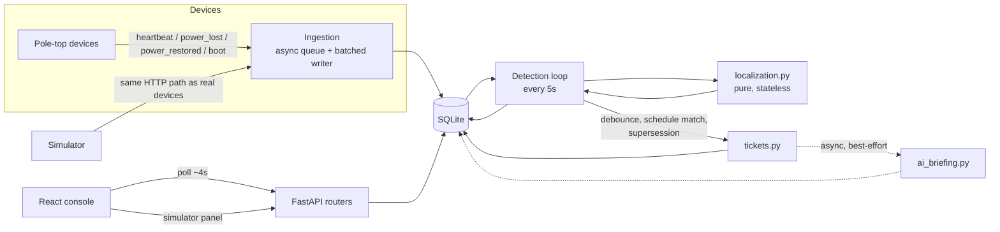

# Architecture

## The problem, in one paragraph

A distribution network is a tree: substation → feeders → transformers (DTs) → poles,
each pole with at most one parent. A fault is a boundary in that tree — the last live
node and the first dark node beyond it. The hard parts are that we don't have pole
ordering for ~60% of transformers, telemetry lies by omission (silence is ambiguous),
~9% of poles have no sensor at all, and a scheduled maintenance shutdown must not be
mistaken for a fault (or vice versa). Everything below is in service of getting that
boundary right, saying how sure we are, and not paging anyone twice for the same wire.

## System diagram

## Data model

`Substation → Feeder → Transformer(DT) → Pole`, plus:

- **Pole**: `parent_pole_id` / `seq_on_line` as imported (null for the missing-topology
  60%); `resolved_parent_pole_id` / `topology_source` as computed by `topology.py` at
  boot. Both are kept so the system never conflates "the registry told us this" with
  "we guessed this from coordinates."
- **PoleState**: the latest raw facts per pole (energized, last event, last seq,
  `became_live_at`/`became_dark_at`). Deliberately stores no derived "is this pole
  dark" boolean — that depends on the current time and config, and a stored boolean
  invites staleness. Derivation is a pure function (`classify_raw`) in `localization.py`.
- **TelemetryEvent**: append-only, including duplicates and out-of-order messages
  (flagged, not dropped), so decisions are auditable after the fact.
- **Incident**: the ticket. `identity_key` (e.g. `span:D-0112:P-024432`) is how the
  detection loop matches a candidate to an already-open ticket across ticks instead
  of creating duplicates. `affected_pole_ids` is the full downstream set (used for
  restoration checks); `candidate_range_pole_ids` is the (usually much smaller)
  boundary-uncertainty range shown to the operator.
- **IncidentEvent**: audit trail, `actor` is `system` or `operator`.
- **ScheduledOutage**: the load-shedding feed, `scope` (`dt`|`feeder`) + `target_id`.

## Topology resolution (`topology.py`)

Known `parent_pole_id`/`seq_on_line` pass through untouched. Where missing, a minimum
spanning tree is grown from the transformer's coordinates using Prim's algorithm,
with every known pole (and the DT itself) pre-seeded as an already-attached "docking
point" — so an unknown pole can attach to the DT, to a known pole, or to another
now-attached unknown pole, whichever is geometrically closest. This was chosen over
plain nearest-neighbour chaining because MST asks "what's the cheapest way to wire
everything back to the transformer," which matches how these lines are actually
built, and naturally produces branches (a real property of these networks) where
that's cheaper than one long run.

Each inferred pole also gets an **ambiguity flag**: if the second-nearest candidate
parent is within 40% of the distance of the chosen one, the edge is flagged as
ambiguous and takes an extra confidence penalty (see below).

Complexity: O(N log N) per transformer with a binary heap (N ≤ ~240 poles per the
brief's own numbers), run once at boot and cached. **Known failure mode, stated
plainly**: geometric proximity is a proxy for "same line," not a certainty — two
physically close but electrically distinct lines (either side of a road) will fool
this. We can't detect that from coordinates alone, which is exactly why inferred
spans carry a confidence penalty instead of being reported as certain.

## Localization algorithm (`localization.py`)

Two linear passes per transformer, applied at the pole, DT, and feeder level with
the same two primitives:

1. **Bottom-up**: does this node's *subtree* contain a confirmed-live pole? If yes,
   current must be flowing that far, so the node itself is provably energised even
   if its own sensor disagrees — the exact justification the brief gives for "an
   isolated dark pole with live children is physically impossible," generalised to
   arbitrary depth and branches.
2. **Top-down**: a node's effective state is live if it's directly confirmed live or
   step 1 proved it; a node is a **frontier** (starts one incident) iff it's
   effectively dark and its parent is effectively live. Nothing below a frontier
   needs walking — the whole subtree is dark by construction.

The same rule at the feeder/DT/pole levels, checked in that priority order, gives DT-
and feeder-level faults for free and guarantees we report the fault at the highest
level it actually manifests rather than as N separate pole-level tickets. Multiple
simultaneous faults fall out for free too — one pass collects every frontier in the
network, not just the first.

**No-device poles (~9% of the network) get special treatment**, added after a real
bug found in end-to-end testing (see below): a pole with no sensor fitted is *never*
treated as evidence of a fault. It inherits its parent's effective state by default
and can never itself trigger a frontier — only a pole that *had* a device and stopped
reporting is real evidence. Without this, every no-device leaf pole in the network
produced a permanent phantom ticket.

**Confidence** is an additive score, not a black box: start at 0.90, subtract for
inferred topology (−0.30) and ambiguous inference (−0.08), subtract scaled by the
fraction of the boundary evidence that's silence-only rather than an explicit
power-loss message (−0.12×), subtract scaled by the fraction with no device at all
(−0.20×), subtract if the upstream "still live" reference pole is itself getting
stale (−0.10), add a small bonus if ≥3 poles independently corroborate the same
boundary (+0.05). Every term becomes a plain-English reason shown to the operator —
deliberately not an opaque ML score, because "how confident and why" is the actual
product requirement.

**Coverage gaps** (a boundary pole with no device, or only a silent-not-confirmed
signal) don't collapse to a fake precise point — `_nearest_confirmed_dark_path` BFSes
from the frontier to the nearest pole with an explicit signal and reports the whole
path as a `candidate_range`, shown to the operator as "the break is somewhere across
these poles" rather than a false-precision single span.

## Ingestion (`ingestion.py`)

The HTTP handler does almost nothing: validate, drop on an in-memory
`asyncio.Queue`, return `202` immediately. A single background writer drains the
queue in batches (300 messages or 250ms, whichever first) and commits each batch as
one transaction — the difference between "fine" and "database is locked" on SQLite's
single-writer model under burst load.

Ordering/dedup is `(device_id, seq)`, never the device's own `ts` (can drift on cheap
hardware). `boot` always applies and resets the sequence counter; anything else is
only applied if `seq` is strictly greater than the last one accepted for that device
— otherwise it's logged (for audit) but doesn't touch state. Location always comes
from `pole_id`, ordering always from `device_id` — a device can be swapped without
losing pole identity.

**Measured throughput** (`scripts/loadtest.py`, results reported honestly rather than
assumed):

- Burst: 5,000 messages accepted in **1.3s** (≈3,800 msg/s accept rate), fully
  drained to disk within 3s — comfortably inside the "5,000 in 10s" target.
- Sustained, single connection: a lone client issuing one request, waiting for the
  response, then the next, sustained **~304 msg/s** over 10s (p50 latency 0.8ms).
  This undershoots the 500 msg/s target — but the bottleneck is that a single
  connection serializes round-trips, not server capacity.
- Sustained, 40 concurrent connections (the realistic shape — many independent
  devices/collectors, not one): **1,374 msg/s**, comfortably over the 500 msg/s
  target, with *lower* per-request latency (p50 0.4ms) than the single-connection
  case, because requests overlap in flight instead of queuing behind each other.
  This is the number that reflects how telemetry actually arrives in production.

Both scenarios hit the real app (`app/main.py`) through the real HTTP-equivalent
path (httpx's ASGI transport), not a shortcut — same routing, same Pydantic
validation, same queue.

## Ticket lifecycle (`tickets.py`, `background.py`)

`detected → acknowledged → crew_assigned → resolved → verified → closed`. `verified`
is set **only** by telemetry (`check_restoration`), never by an operator action —
marking a ticket `resolved` records what a lineman claimed, and the API tells the
operator immediately if the affected poles are still dark rather than letting them
find out later. A pole with no device is (again) treated as vacuously restored — the
same bug class as above, found the same way, because otherwise any incident whose
subtree included a no-device pole could never verify at all.

**Debounce**: a fresh candidate must persist for `DEBOUNCE_SECONDS` (30s default)
across detection ticks before it becomes a ticket, so a storm doesn't fire a dozen
half-formed incidents while telemetry is still arriving.

**Escalation/supersession**: because silent (unconfirmed) poles cross into confirmed-
dark at different times, a fault can genuinely start as several span-level tickets
and coarsen into one DT-level ticket as more evidence arrives. Rather than leave the
narrower tickets open and orphaned — duplicate alerts for one root cause — they're
closed with an audit note pointing at the ticket that superseded them. Found and
fixed via end-to-end testing with a scheduled-DT-outage scenario.

## Scheduled-outage matching (`scheduled_outages.py`)

Suppression fires only on an **exact** match between a candidate's own type+target
and a schedule's declared scope+target — never a fuzzy "somewhere nearby" match, and
never for span-level faults (a snapped line inside a DT that also has an unrelated
scheduled shutdown is still real). A schedule is "active" from `start − grace` to
`end + grace` (40 min default either side), covering early/late starts and overruns.
A schedule that was silently cancelled needs no special handling — nothing goes dark
for it, so nothing is suppressed or falsely alerted. If the footprint is still dark
past `end + grace`, the ticket is promoted out of suppression into a normal one.

## API surface

| Endpoint | Purpose |
|---|---|
| `POST /api/telemetry`, `/telemetry/batch` | device ingestion |
| `GET /api/incidents`, `/incidents/{id}`, `/incidents/{id}/events` | tickets + audit trail |
| `POST /api/incidents/{id}/{acknowledge,assign-crew,resolve,close}` | lifecycle actions |
| `GET /api/poles`, `/topology/{dt_id}`, `/stats` | map data, topology inspection, dashboard |
| `POST /api/simulator/{fault,repair,storm}`, `GET /simulator/status` | the evaluation harness |
| `GET/POST /api/simulator/scheduled-outages` | the load-shedding feed |

## Known limitations (stated, not hidden)

- Two genuinely separate faults on the same branch, seconds apart, may initially
  present as one boundary until the inner one produces its own confirmed signal.
- A DT where literally every pole is silent at once reads as a DT fault (the more
  actionable interpretation); a correlated comms-layer failure (e.g. an NB-IoT tower
  outage) would look identical and we have no backhaul-health signal to tell them apart.
- Households-affected is an estimate (DT total × fraction of poles downstream), not
  a per-pole count — the registry doesn't have one, and the UI labels it as an estimate.
- Real-time updates are polling (~4s for incidents, ~15s for the map), not
  WebSockets — a deliberate reliability trade-off, see DECISIONS.md.
- Pending (not-yet-debounced) candidates and simulator fault state live in memory,
  not the DB — a process restart loses a few seconds of in-flight debounce state.
  Persisted tickets are unaffected.

## Scaling from one subdivision to thirty

What would **not** need to change: the localization algorithm itself (already O(N)
per network per tick), the schema (Feeder/Transformer/Pole already scope everything),
the confidence model. What **would**: SQLite's single-writer model (see DECISIONS.md
for why it was still the right call here) → Postgres with connection pooling; the
in-process topology cache → keyed by subdivision, still fits comfortably in memory at
30× scale (a few hundred thousand poles); the polling UI → likely worth WebSockets or
SSE once there are enough concurrent operators that polling load matters; the
in-memory debounce/fault-injection state → Redis or a DB table if the process needs
to be horizontally scaled rather than just vertically.
